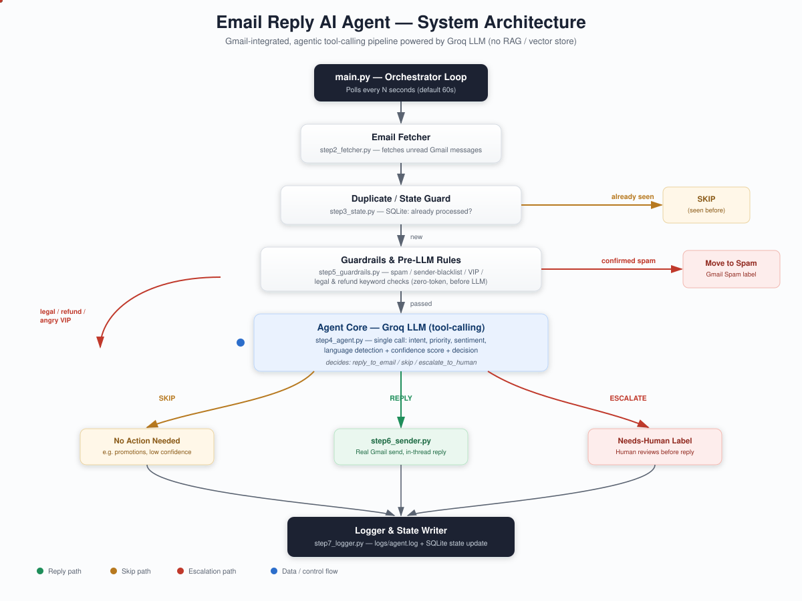

# Email Reply AI Agent

**An autonomous, Gmail-integrated AI agent that reads incoming email, decides whether it needs a response, drafts that response in the sender's own language and tone, and — when it is confident enough — sends it, entirely on its own.**

  
  
  
  
  

---

## Overview

The **Email Reply AI Agent** is a fully autonomous email-handling system built on top of the Gmail API and a Groq-hosted large language model. Unlike a simple auto-responder, it behaves like an agentic system: on every polling cycle it fetches recent unread mail, filters out noise, reasons about each message using LLM-driven tool calling, and independently chooses one of three actions — **reply**, **skip**, or **escalate to a human** — before acting on that decision inside the user's actual Gmail account.

The project was built as a complete, end-to-end system rather than a proof of concept: authentication, decision-making, guardrails, sending, failure recovery, logging, a human-review console, a measured evaluation, automated testing, and deployment are all implemented and working together as a single pipeline, and the agent has been run against a live Gmail inbox.

## Problem Statement

Individuals and small teams who manage their own inbox face a recurring set of problems:

- **Repetitive, low-value replies** (business hours, availability, simple queries) consume time that could be spent elsewhere.
- **Manual triage is inconsistent** — urgent messages, angry customers, or legal/refund disputes can sit unread alongside newsletters.
- **Naive "auto-reply" tools are unsafe.** They cannot tell a genuine customer complaint from a promotional email, cannot detect urgency or sentiment, answer automated mail in endless loops, and will confidently send a wrong, invented, or tone-deaf reply with no human oversight.
- **Multilingual inboxes** (English, Urdu, Roman Urdu) are poorly served by most automation tools, which assume a single language.

A system that blindly replies to everything is not useful — it is a liability. What is needed is an agent that can be trusted to act *only* when it is safe and appropriate to do so, and to defer to a human otherwise.

## Our Solution

The Email Reply AI Agent addresses this by combining **agentic LLM tool-calling** with **deterministic, zero-token safety checks** that run both before and after the model call. Every email passes through:

1. **Fetching** — only new, unread messages from the last two days are considered, so an old backlog is never answered.
2. **Deduplication** — a local state store and an `AI-Processed` Gmail label guarantee that no message is processed, or replied to, twice.
3. **Guardrails** — cheap, rule-based checks (automated and bulk mail, sender blacklists, learned spam, per-thread rate limits, prompt injection, legal/refund keywords, angry VIP senders) run first, without spending any LLM tokens.
4. **Agent reasoning** — a single Groq LLM call classifies intent, urgency, sentiment, and language, assigns a confidence score, and chooses an action, using only the facts written in the business information file; the draft is then checked before anything is sent.
5. **Action execution** — the agent replies in-thread through the real Gmail API, saves an uncertain reply as a draft for review, escalates to a human via a Gmail label, moves spam to the Spam folder, or takes no action.
6. **Logging** — every decision is recorded for auditability and can be reviewed in the human-review console.

The result is an agent that automates the repetitive part of inbox triage while deliberately routing the sensitive or ambiguous part to a human — instead of guessing.

## System Architecture

The diagram above shows the full decision pipeline the agent executes on every polling cycle. At a high level:

| Stage | Responsibility | Module |
|---|---|---|
| Orchestrator | Drives the polling loop and applies each decision | `main.py`, `src/orchestrator.py` |
| Fetcher | Retrieves recent unread Gmail messages | `src/step2_fetcher.py` |
| State Guard | Prevents reprocessing the same email | `src/step3_state.py` |
| Guardrails | Zero-token spam / VIP / legal-keyword filtering | `src/step5_guardrails.py` |
| Agent Core | LLM-driven classification and decision-making | `src/step4_agent.py` |
| Sender | Sends the real, in-thread Gmail reply | `src/step6_sender.py` |
| Logger | Persists every decision and outcome | `src/step7_logger.py` |

Only messages that pass every guardrail reach the LLM, which keeps the system both fast and inexpensive to run on free-tier API limits.

## Key Features

- **Fully autonomous inbox loop** — continuously polls Gmail every 60 seconds until stopped, with no manual triggering required; `--once` processes the inbox a single time.
- **Real, in-thread Gmail replies** — not a simulated draft; replies are sent through the Gmail API, stay correctly threaded, and respect the sender's `Reply-To` address.
- **Agentic tool-calling decision-making** — the LLM itself selects between `reply_to_email`, `skip_email`, and `escalate_to_human` as callable tools, rather than the code guessing an intent from raw text.
- **Intent and category classification** — every email is labeled as `sales_inquiry`, `complaint`, `support_request`, `meeting_request`, `invoice_payment`, `general_query`, or `other`, and tagged with a matching Gmail label automatically.
- **Priority and urgency detection** — a free keyword pre-scan re-orders each polling batch so urgent messages are handled first, and the LLM assigns a final priority label.
- **Sentiment-aware replies** — negative or angry senders automatically receive a more empathetic tone, and genuinely angry complaints are escalated rather than auto-replied to.
- **Multilingual support** — English, Urdu (script), and Roman Urdu are detected automatically, and the reply is drafted in the same language the sender used.
- **Confidence-gated sending** — if the model's confidence in a reply falls below a configurable threshold, or the draft contains a link or address that is not in the business file, the reply is not sent; it is saved as a Gmail draft and tagged `Needs-Review`.
- **Zero-token escalation rules** — legal-threat language, refund/payment disputes, prompt-injection attempts, and angry messages from VIP senders are force-escalated to a human before any LLM call is made, both for safety and cost efficiency, using whole-word matching so that harmless words like "courtesy" do not trigger them.
- **Self-learning spam filter** — spam-classification mistakes can be corrected via a simple CLI command; after two corrections, the agent automatically adjusts its future treatment of that sender.
- **Real spam handling** — confirmed spam is physically moved into Gmail's Spam folder, not just silently ignored.
- **Structured logging** — every fetch, decision, and action is logged to `logs/agent.log` for full auditability.
- **Automated test suite** — 128 tests cover the fetcher, sender/MIME, agent decision-making, guardrails, evaluation, webhook, and failure scenarios such as failed sends, crashes mid-send, a lost database, and Gmail label conflicts.
- **Optional real-time mode** — a verified Gmail Pub/Sub push-notification webhook is available as a drop-in alternative to polling.
- **Deployment-ready** — documented for both local scheduled execution (Windows Task Scheduler) and 24/7 cloud hosting (Railway), including login on a server without a browser.
- **Grounded answers only** — the agent may only state facts written in `knowledge/business_info.md`; when an answer needs anything else, such as prices or stock, it escalates instead of inventing one.
- **No duplicate replies** — a reply is recorded before and immediately after it is sent, so a failed label update, a crash, or a lost database can never cause the same email to be answered twice.
- **Human-review console** — a Streamlit dashboard shows escalated and uncertain emails, lets a person edit and send the AI's draft, and records whether each AI decision was correct.
- **Dry-run mode** — `--dry-run` shows every decision the agent would make without sending, labeling, or recording anything.
- **Measured evaluation** — the full decision pipeline is evaluated on 55 labeled emails in English, Urdu, and Roman Urdu, reaching 98.1% decision accuracy with no legitimate email sent to Spam.

## What Makes This Different

Most "email auto-reply" projects fall into one of two categories: a fixed if/else rule engine, or a thin wrapper that sends whatever the LLM outputs with no safety net. This project is neither.

- **Safety comes before intelligence.** Deterministic guardrails run *before* the LLM is ever called, so the riskiest categories of email (legal threats, payment disputes, angry VIPs) never depend on model judgment at all.
- **One LLM call does the work of five.** Intent, priority, sentiment, language, and confidence are all extracted from a single Groq tool-calling call, keeping the system fast and within free-tier rate limits rather than chaining multiple expensive API calls.
- **The agent knows when not to act.** Confidence scoring and draft checks mean the system is explicitly designed to hold back and defer to a human when it is unsure, rather than optimizing for reply volume.
- **It improves itself.** The spam-feedback loop lets the system learn from corrections without retraining a model or writing new rules by hand.
- **It is genuinely bilingual.** Replies are drafted in the sender's own language and register, which most inbox-automation tools do not attempt.
- **It is measured, not just built.** Decisions are evaluated with business-risk metrics, such as how often a legitimate email is lost to Spam and how often an email that needed a person was answered automatically.

### Scenarios

| Scenario | Trigger | Expected Behavior | Log Entry |
|---|---|---|---|
| Promotional email | Any newsletter-type message | Filtered by guardrails, never reaches the LLM | `SKIP (source=guardrails)` |
| Normal query | e.g. "What are your business hours?" | LLM replies directly, in-thread | `REPLY` |
| Complaint / legal threat | e.g. refund demand with legal language | Escalated, `Needs-Human` label applied, no auto-reply sent | `ESCALATE` |
| Uncertain reply | e.g. an unclear request answered with low confidence | Reply saved as a Gmail draft, `Needs-Review` label applied, nothing sent | `REVIEW` |
| Scam or phishing | e.g. "You won $10,000, send your bank details" | Moved to the Gmail Spam folder | `SPAM` |

## Conclusion

The Email Reply AI Agent demonstrates a complete, production-oriented approach to inbox automation: it does not simply generate replies, it makes accountable decisions about *when* to reply, *when* to stay silent, and *when* to hand control back to a human. By pairing deterministic safety guardrails with a single, grounded LLM reasoning step, checking its own drafts before sending, and measuring how often it gets those decisions right, the system is both cost-effective and trustworthy enough to run unattended against a real inbox — which is the standard a genuinely useful email agent needs to meet.